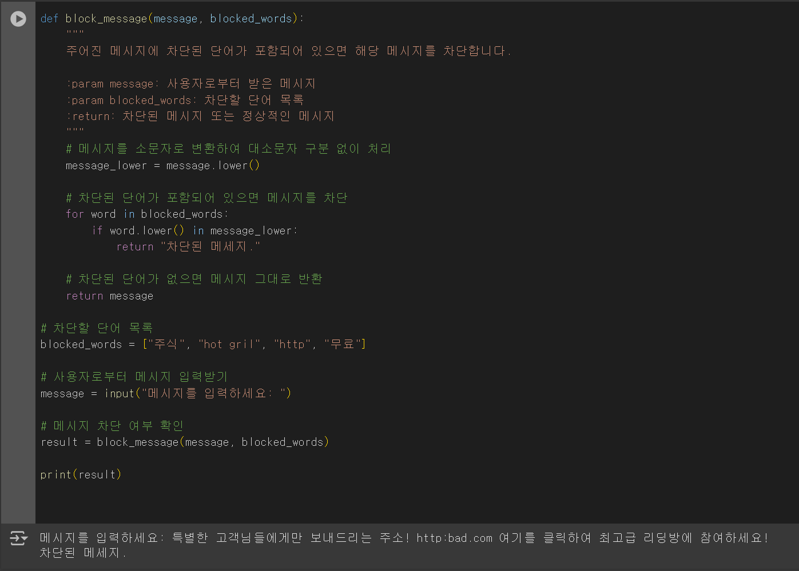
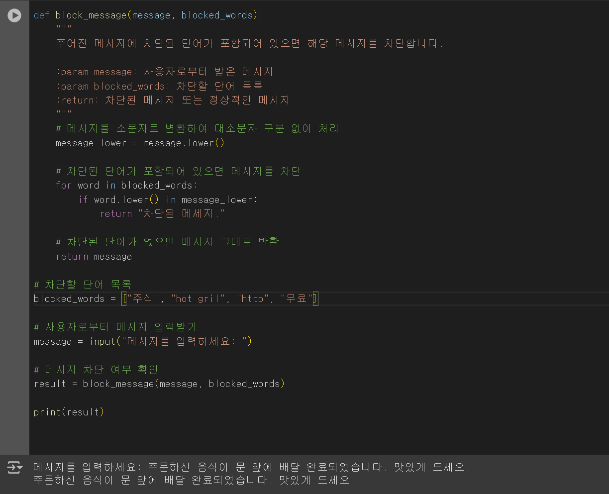

# project(2020131050)에 대한 프레젠테이션

# 스팸메세지 내용차단 프로그램

## Project Motivation
한동안 제 휴대폰에 스팸메세지가 너무 많이 왔습니다. 올 때 마다 바로 차단하더라도 무의미했습니다. 왜냐하면 랜덤한 번호로 메세지를 보내왔기 때문에 차단하는 의미가 없었습니다. 너무 화가나서 답장으로 욕을 해봐도 보이스피싱 범죄자들에게 닿지도 못했습니다.
그래서 해결방법을 찾던 중, 어느 어플을 다운받으면 특정 단어가 포함된 메세지를 자동으로 차단해주는 기능을 사용할 수 있다는 것을 알았습니다. 스팸메세지는 주로 '주식, 성매매'와 관련된 단어들이 많았기 때문에 그와 관련된 단어들을 모조리 차단단어 목록에 입력했고
그 결과 스팸메세지를 통한 알람이 줄어들었습니다. 그 덕에 스팸메세지가 일상생활에 큰 지장을 주지 못하도록 해결했습니다. 그래서 이러한 프로그램을 직접 코딩하기로 결정했습니다. 아직 실력이 많이 부족하여 실제로 휴대폰에 오는 메세지를 걸러주진 못합니다. 하지만
차단하고 싶은 단어가 포함된 메세지는 내용을 표시하지 않고 '차단된 메세지' 정도로만 표시하도록 했습니다. 

## 사용 방법
1. `spamblock program.py` 파일을 실행합니다.
2. 차단하고 싶은 단어를 '차단할 단어 목록'에 입력합니다.
3. '메세지를 입력하세요' 란에 필터링 할 메세지를 입력합니다.
4. 결과를 관찰합니다.

## 프로그램 작동 방식 설명
1. block_message 함수는 두 개의 매개변수로 이루어져 있습니다. 하나는 사용자 메시지 message, 또 하나는 차단할 단어 목록 blocked_words입니다. 이 함수는 주어진 메시지에서 차단된 단어가 포함되어 있으면 해당 메시지를 차단하고, 없으면 원래 메시지를 반환합니다.
2. 사용자로부터 입력받은 메시지에 영어가 포함되어 있다면 대문자를 소문자로 변환하여, 대소문자 구분 없이 단어를 검색합니다. 예를 들어 "HOT girl", "hOt GiRl" 또는 "Hot Girl"과 같은 단어를 모두 동일하게 처리할 수 있습니다.
3. blocked_words 리스트에 정의된 차단 단어들을 순차적으로 확인하면서, 사용자가 입력한 메시지에 포함되어 있는지 검사합니다. 각 차단 단어는 소문자로 변환하여 비교합니다.
4. 만약 차단된 단어가 메시지에 포함되지 않으면, 입력된 메시지를 그대로 반환합니다. 이때, 차단할 단어들은 미리 blocked_words 리스트에 정의되어 있습니다. 여기서 "주식", "hot gril", "http", "무료"과 같은 단어를 차단 대상으로 설정합니다.
5. input() 함수를 사용하여 사용자로부터 메시지를 입력받습니다.
6. 사용자가 입력한 메시지를 block_message 함수에 전달하여 차단된 단어가 포함되어 있는지 확인하고, 그 결과를 result에 저장합니다.
7. block_message 함수의 반환 값을 출력하여, 차단된 메시지인지 아니면 정상 메시지인지를 사용자에게 보여줍니다.

## Performance example
릿코드에 돌려봤을 때 잘 작동하는 것을 확인했습니다. 
차단하고 싶은 단어로 설정된 단어가 포함된 메세지는 첫번째 그림처럼 차단된 메세지로 표시되고, 
차단하고 싶은 단어가 포함되지 않은 일반적인 메세지는 정상적으로 표시되었습니다.

